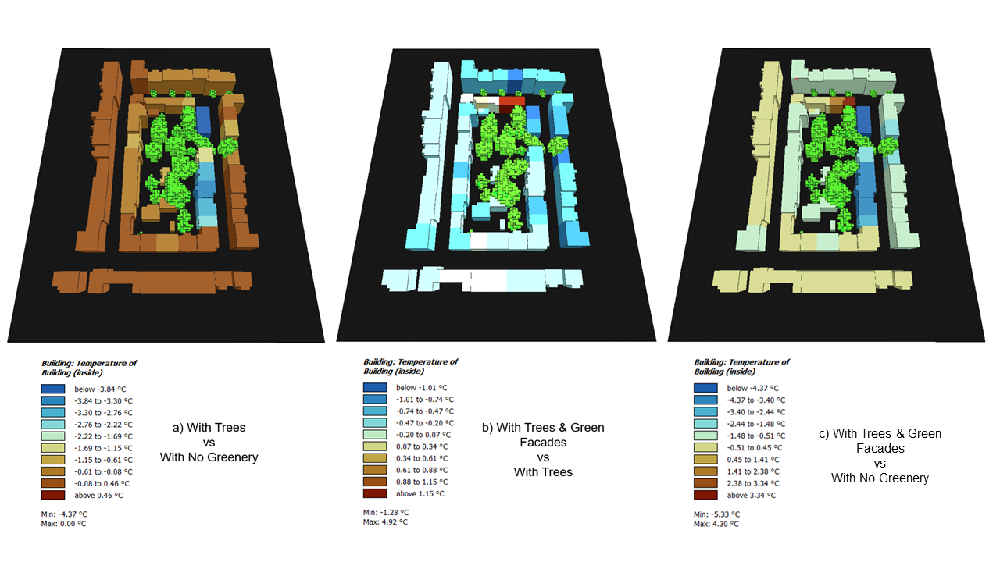
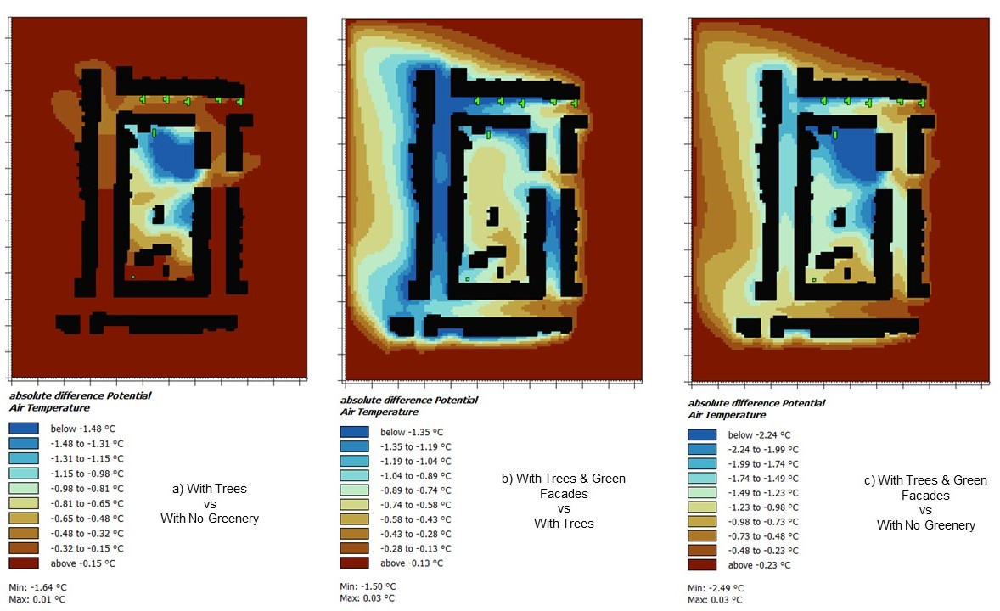
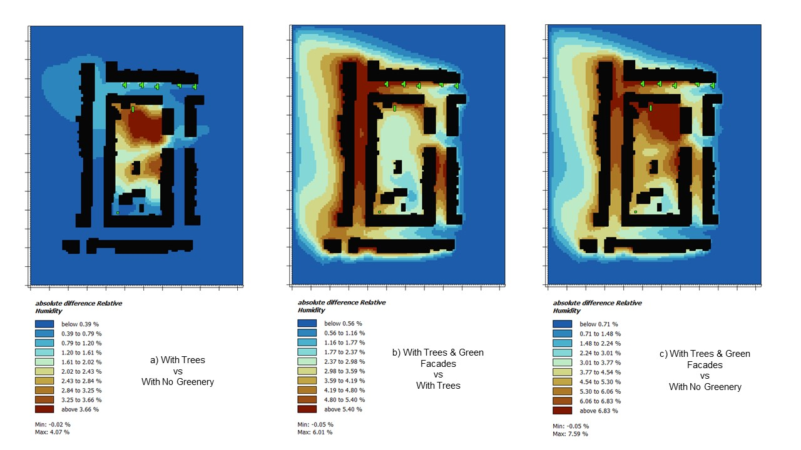
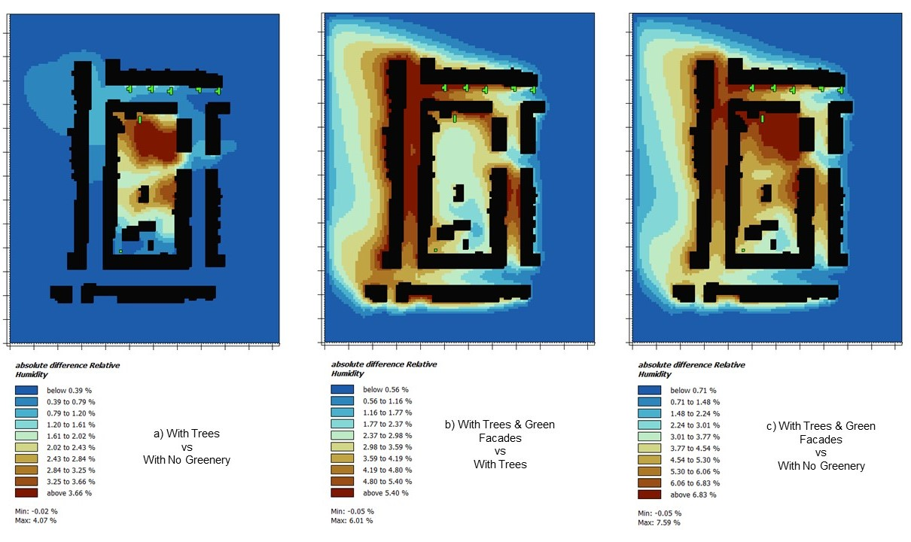

# sim_greenfacade

# Investigating the Effects of Green Walls on Local Climate Regulation: A Case Study for Dresden

## Overview
This repository contains the code and data used in the master thesis titled "Investigating the Effects of Green Walls on Local Climate Regulation: A Case Study for Dresden." The study explores the potential of facade greening to mitigate urban heat island effects and improve thermal comfort in urban settings, specifically in Dresden, Germany.

## Table of Contents
- [Introduction](#introduction)
- [Methodology](#methodology)
- [Results](#results)
- [Usage](#usage)
- [Dependencies](#dependencies)
- [Contributors](#contributors)
- [License](#license)

## Introduction
Urban environments face significant challenges from heat island effects, air pollution, and declining biodiversity. This study investigates how green walls can help mitigate these issues by improving local microclimates. Using ENVI-met simulation software, the study assesses various thermal comfort variables under three scenarios:
1. With No Greenery
2. With Trees
3. With Trees & Green Facade

## Methodology
1. **LCZ Classification**: Using the LCZ generator and Google Earth to create training areas and classify the urban landscape.

[LCZ Generator Factsheet](https://lcz-generator.rub.de/factsheets/bdacb8b7fafe468c530b37b1e0a7733314796422/bdacb8b7fafe468c530b37b1e0a7733314796422_factsheet.html)

 *LCZ Outcome Data*

| LCZ class | Count | Avg. area (km²) | Total area (km²) | Perimeter (km) | Shape | Vertices |
|-----------|-------|-----------------|------------------|----------------|-------|----------|
| 2         | 5     | 0.2             | 1.0              | 1.9            | 1.9   | 7.4      |
| 5         | 7     | 0.3             | 2.4              | 2.6            | 1.7   | 7.6      |
| 6         | 6     | 0.3             | 1.7              | 2.1            | 1.4   | 4.3      |
| 10        | 4     | 0.3             | 1.2              | 2.5            | 1.6   | 7.0      |
| 11        | 4     | 0.4             | 1.7              | 2.8            | 1.5   | 5.8      |
| 12        | 5     | 0.1             | 0.3              | 1.1            | 1.6   | 4.6      |
| 14        | 4     | 0.2             | 0.9              | 2.3            | 1.9   | 4.8      |
| 16        | 3     | 0.1             | 0.4              | 1.5            | 1.4   | 6.7      |
| 17        | 5     | 0.1             | 0.5              | 1.6            | 2.3   | 4.8      |

2. **Study Site Selection**: Chose the outer Neustadt district in Dresden, characterized by Wilhelmine architecture and low greenery.
3. **Database Development**:
   - **Building Materials**: Information on wall compositions and thermal properties.
   - **Building Footprints**: Extracted from open geographical data.
   - **Trees and Existing Greenery**: Adjusted using field observations and refined open data.
   - **Climbing Species**: Selected Hedera Helix for its prevalence and characteristics.
   - **Meteorological Data**: Used EPW files for precise simulation inputs.
4. **ENVI-met Simulation**:
   - Built the simulation using the ENVI-met plugin in QGIS.
   - Developed three greening scenarios.
   - Extracted data using ENVI-met Leonardo for analysis.
5. **Statistical Analysis**:
   - Normality tests using Shapiro-Wilk.
   - Friedman Two-Way ANOVA for significance testing.
   - Post-hoc pairwise comparisons for detailed analysis.

## Results
The results indicate significant improvements in microclimate parameters with the introduction of green facades and trees. Key findings include:
- Lower **air temperature inside the buildings**.

- Lower **air temperatures**.

- lower **mean radiant temperatures**.

- Enhanced **relative humidity** levels.

- Marginal effects on **wind speed**.

- Improved thermal comfort in urban environments.

## Usage
To run the simulations and analyses:
1. Clone this repository.
2. Ensure all dependencies are installed (see below).
3. Follow the scripts provided in the `/scripts` directory to set up and run ENVI-met simulations.
4. Use the provided Python scripts for statistical analysis and data visualization.

## Dependencies
- ENVI-met software
- QGIS
- Python 3.11
  - `pandas`
  - `numpy`
  - `scipy`
  - `matplotlib`

## Contributors
- **Amir Raoufi** - Main Author ([amir.raoufi@mailbox.tu-dresden.de](mailto:amir.raoufi@mailbox.tu-dresden.de))

## License
This project is licensed under the MIT License.

